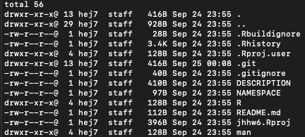

# jhhw6
To fulfill homework requirements

Two R functions, get_hypotenuse_length and trimmed_mean, are available

The files' permission levels, link counts, owner, group, sizes, last modified date times, and names were shown in the above screenshot

The .git folder contains all information that is necessary for the project and all information relating commits, remote repository address, etc. It also contains a log that stores the commit history. This log can help you to roll back to the desired version of the code

